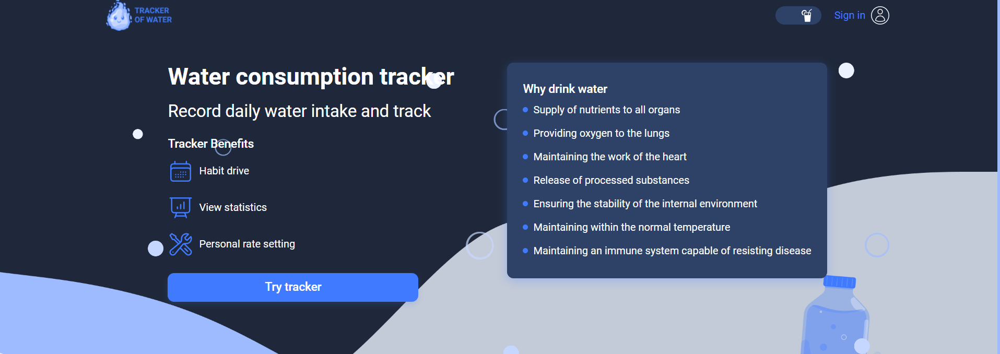
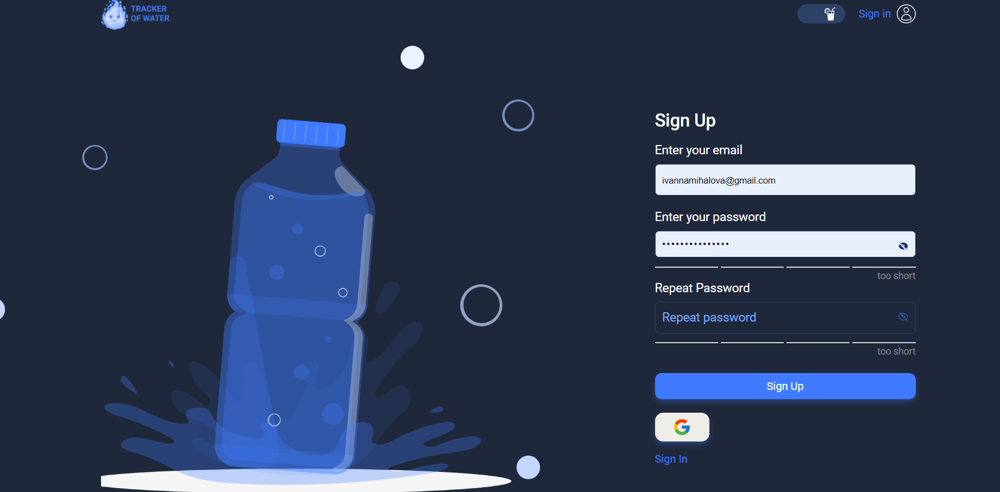
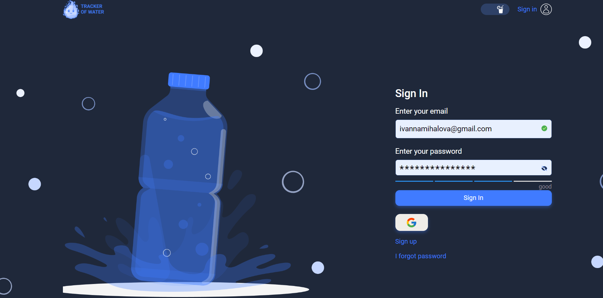
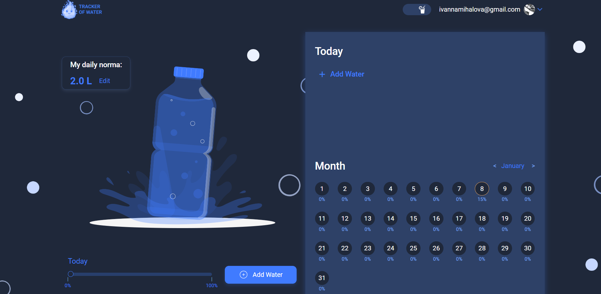
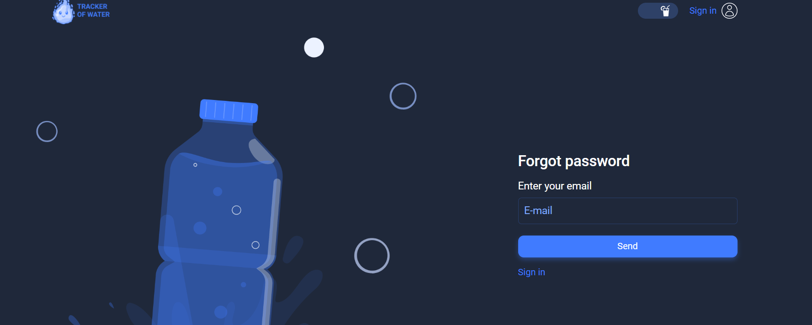
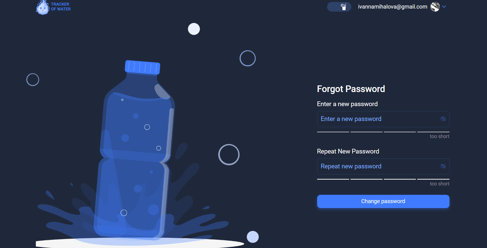

# Water Tracker - Your Reliable Guide to a Healthy Lifestyle

WaterTracker is a user-friendly application designed to assist you in
maintaining a healthy lifestyle by keeping track of your daily water intake.
Proper hydration is key to overall well-being, and this app aims to make it
easier for you to monitor and improve your water consumption habits.

## Table of content

- [Features](#features)
- [Routing](#routing)
- [Contributors](#contributors)
- [Getting Started](#getting-started)
- [Technologies Used](#technologies-used)
- [API](#api)

## Features

1. Personalized Recommendations: Receive customized hydration recommendations
   based on your lifestyle, and physical activity.

2. Convenient Monitoring: Easily log and track your daily water intake through
   our intuitive and user-friendly interface.

3. Progress Analytics: Visualize your hydration progress over time with detailed
   statistics and insightful analytics.

4. Goal Setting: Set personal hydration goals and track your achievements,
   fostering a sense of accomplishment and motivation.

5. Educational Resources: Access a wealth of educational materials and articles
   about the importance of water, its role in the body, and the benefits of
   maintaining a proper hydration routine.

   ## Routing

   The app uses React Router for navigation. The available routes are:

   - `/` - Welcome Page

Welcome to the first page of WaterTracker – your guide to a healthy lifestyle!

Here, you can find a brief overview of the benefits of our application and learn
about the importance of maintaining a water balance. Our app simplifies tracking
and improving your daily water consumption by providing personalized
recommendations and analyzing your progress.

After reading this information, you can choose your path: register to access all
the app features or log in if you're already registered. Our registration system
helps tailor your experience so you can make the most of WaterTracker for your
health and well-being.

For your convenience, we have added a theme change button (light or dark) next
to the login link.

Let your journey to health begin right now with WaterTracker! 🚰💧

- `/signup` - Sign Up Page

To register, you need to enter your email and create a password for your
account.

!!! Please note that the password must be at least 8 characters long and include
at least one Latin letter. Additionally, make sure to confirm the password by
entering it again.

If you already have an account, you can proceed to the login page.

- `/signin` - Sign In Page

To log in, you need to enter your email and the password you provided during
registration. For your convenience, we have also added Google authentication.

If you haven't registered yet, you can go to the registration page.

If you're already registered but forgot your password, no worries. Simply follow
the `I Forgot Password link` to set a new password and continue using our app
seamlessly.

- `/home` - Home Page

The main page of our application is the home page, which you land on immediately
after registration or login. Here, you can manage your account through settings,
such as adding an avatar or changing your password. The core functionality
revolves around tracking your water balance in daily life.

To begin, you need to determine your daily water consumption goal by clicking
the "Edit" button on the "Daily Norm" element. To do this, input your data
(gender, weight, and physical activity level). Our application automatically
calculates your daily norm. Alternatively, you can use our provided formula to
calculate it manually.

Your next step is to enter the amount of water you've consumed into the table
above the calendar. Specify the quantity in milliliters and the time it was
consumed.

!Note that you cannot add more than one entry at the same time and cannot enter
0 ml.

After adding entries, you can edit or delete them. For your convenience, the
page includes a calendar, allowing you to track the percentage of water consumed
each day.

- `/forgot-password` - Forgot Password Page

This page is intended for cases where you have already registered but cannot log
in due to a forgotten password. When you navigate to this page, you need to
enter the email address you used during registration and click the "Send"
button. After that, we will send you an email with a link. By following this
link, you will be able to create a new password for your account.

  

- `/reset-password` - Reset Password Page

You will land on this page when you follow the link in the email sent to you.
Here, you need to enter a new password and confirm it.

Please note that the password must be at least 8 characters long and include at
least one Latin letter.

After entering the new password, you will be automatically redirected to the
home page of your account.

  

## Contributors

### Front End

- Yan Lozovskiy [Github](https://github.com/YanLozovskyi) ||
  [Linkedin](https://www.linkedin.com/in/yanlozovskyi/) - Front End Team Lead,
  Developer
- Iryna Karpusenko [Github](https://github.com/irailcha) ||
  [Linkedin](https://www.linkedin.com/in/iryna-karpusenko-a851a8289/) - Scrum
  Master
- Ivanna Vaskovets [Github](https://github.com/Ivano4ka8) ||
  [Linkedin](https://www.linkedin.com/in/mykhalova-ivanna/) - Developer
- Olesia Kubska [Github](https://github.com/OlesiaKubska) ||
  [Linkedin](www.linkedin.com/in/olesia-kubska) - Developer
- Ann Zubchenko [Github](https://github.com/anetta999) ||
  [Linkedin](https://www.linkedin.com/in/anna-zubchenko-b69560286/) - Developer
- Yana Halaiko [Github](https://github.com/YanaGalayko) ||
  [Linkedin](https://www.linkedin.com/in/yana-halaiko/) - Developer
- Yuliia Stepanovych [Github](https://github.com/some-pinchpenny) ||
  [Linkedin](https://www.linkedin.com/in/yuliia-stepanovych/) - Developer
- Maksym Mizernyi [Github](https://github.com/MizakaMaks) ||
  [Linkedin](https://www.linkedin.com/in/maksym-mizernyi/) - Developer

  ### Back End

- Volodymyr Fetisov [Github](https://github.com/Fetivol) ||
  [Linkedin](www.linkedin.com/in/volodymyr-fetisov) - Back End Team Lead,
  Developer
- Stanislav Boychuk [Github](https://github.com/Fasten-belts) ||
  [Linkedin](http://linkedin.com/in/stanislav-boychuk) - Developer
- Serhii Kozhanov [Github](https://github.com/LIGHT131313) ||
  [Linkedin](https://www.linkedin.com/in/serhii-kozhanov/) - Developer

## Getting Started

To run the application locally, follow these steps:

1. Clone the repository:
   `git clone https://github.com/YanLozovskyi/water-tracker.git`
   
2. Install dependencies: `npm install`
   

3. Run the app: `npm run dev`
   

4. Open [http://localhost:5173](http://localhost:5173) in your browser (Note:
   the port may be changed if 5173 port is occupied by another website).

   ## Technologies Used

- React
- Redux Toolkit
- React Router
- Axios (for API requests)
- Vite

## API

The application utilizes a backend developed by our team. Feel free to
familiarize yourself with it
[here](https://github.com/LIGHT131313/WaterTracker_backend)
